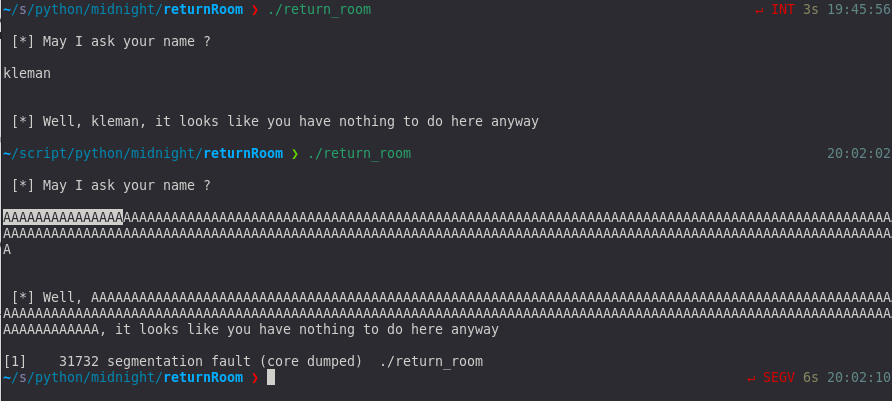
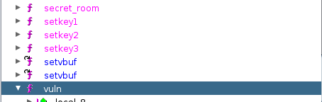
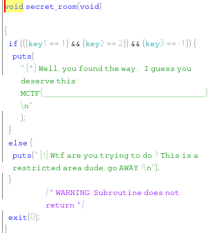
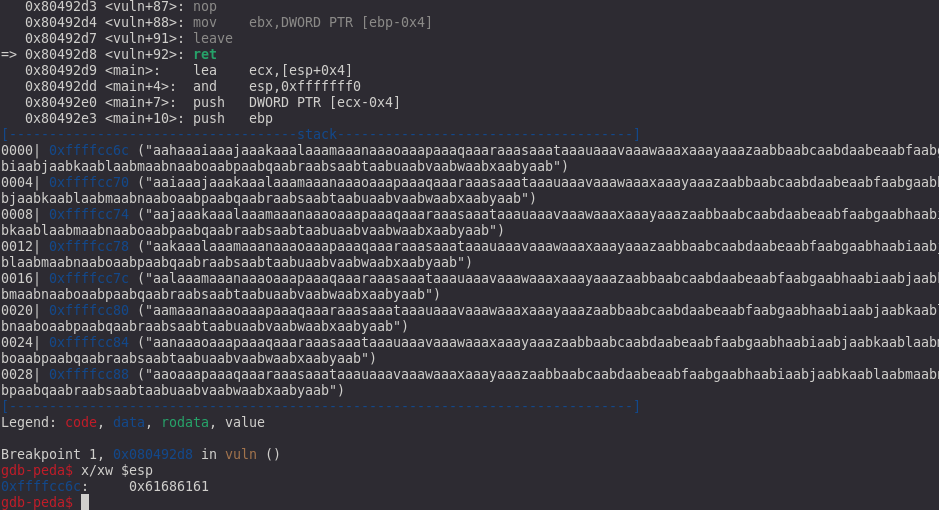
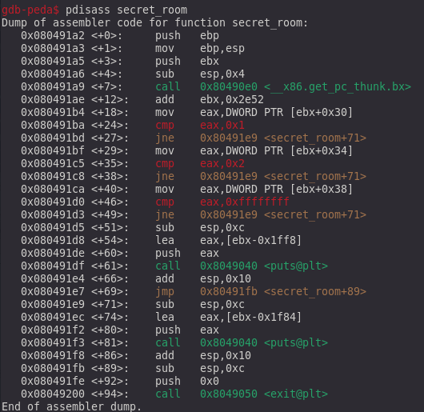
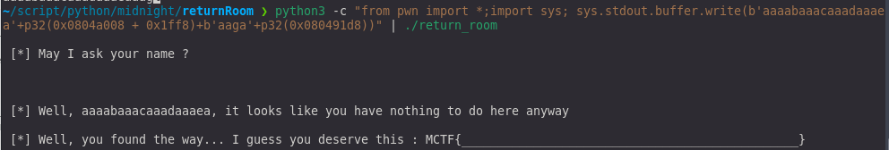

**_PWN_**

**TL;DR**

ce chall de pwn est assez rigolo, avec le nom du chall on pense tout de suite qu'il va falloire utiliser un bufferoverflow 
pour faire une mini ROPchain, mais j'ai utilisé une astuce pour simplifier l'exploitation.

**Analyse du chall**

on n'observe uniquement 1 input qui contient un bufferoverflow. Maintenant au travaille
maintenant jetons un coup d'oeil avec ghidra.

5 fonctions nous sautent aux yeux, vuln qui est notre fonction qui fait un scanf
puis setkey1, setkey2, setkey3 puis secret_room qui fait quelque check avant d'afficher le flag.

on voit que le but du chall est de réussir à appeler la fonction secret_room avec les bonnes valeur pours reussir
à puts notre flag.
Utilisons une petite astuce au lieu de chainer les 3 fonctions setkey et de jump dans secret_room on peut essayer de jump direct
dans le puts pour afficher notre flag.

**exploitation**

On commence par lancer le code dans gdb avec une chaine cyclic on réussie facilement a trouver l'offset pour écrire sur l'eip (pointeur d'instruction)

maintenant essayons de jump juste avant le puts sur le lea eax,[ebx -0x1ff8] qui l'argument du puts.

Il ne reste plus qu'à faire pointer ebx-0x1ff8 sur la chain qui contient le flag.LA chaine qui contient le flag ce trouve
en 0x0804a008 donc il faut que ebx soit égale a 0x804c000.
une fois fini on assemble ca payload 
 
    python3 -c "from pwn import *;import sys; sys.stdout.buffer.write(b'aaaabaaacaaadaaaea'+p32(0x0804a008 + 0x1ff8)+b'aaga'+p32(0x080491d8))"

l'exploit marché en local il suffit maintenant de la pipe dans un netcat et le tour est joué.
 
Merci encore aux créateur et organisateur du CTF qui était vraiment super.

